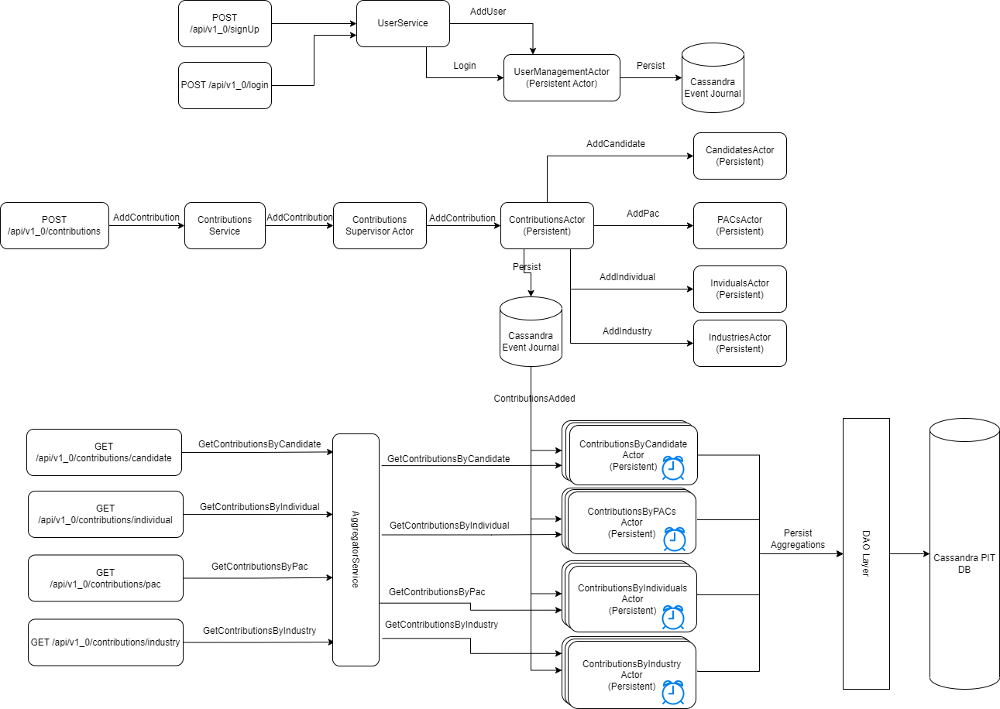

# Campaign finance API

This API provides the functionality required to keep track of campaign contributions, is able to register
individual contributions and contributions through PACs (political action committees)

It provides endpoints that allow to register committees, individuals, candidates, and individual 
and committees contributions

## Scope
### Security: 
Basic level of security based on JWT tokens. As part of the security administration and authentication mechanisms, following endpoints will be provided:
* /api/v1_0/login -> requires username & password, a token with an expiration date will be provided
* /api/v1_0/signUp -> Requires a basic user information, userCode, firstName, lastName, email & password. No roles required in order to simplify the security ?

### Error handling: 
not completely understood yet. For now, each endpoint will define a set of HTTP codes along with some ErrorInfo object that should be returned as part of the response body. *TODO:* Not sure yet, if I should implement a generic error handler

### Endpoints:
The dataset contains several entities that can result in either the creation of a persistent actor or a table. In order to reduce the scope of the application we will not provide endpoints to update such information
Instead, all information will be derived from the main data which are the contributions and saved accordingly through the contributions save endpoints.
Following endpoints will be provided
* POST /api/v1_0/login: Authentication endpoint. Part of the security mechanisms
* POST /api/v1_0/signUp: ??? allows to create users which can be used to access the API
* POST /api/v1_0/contributions: Allows to register individual or pac contributions

Read: All read endpoints are reads from a point in time db that will contain contributions aggregated 
by individuals, pacs, candidates and industry codes 
* GET /api/v1_0/contributions/candidate?cid=<candidate Id>&cycle=<Optional cycle> finds all contributions done to an specific candidate
* GET /api/v1_0/contributions/individual?contributorId=<Id of the contributor>&cid=<Optional candidate Id>
* GET /api/v1_0/contributions/pac?industryCode=<Industry code>&cid=<Optional candidate Id>
* GET /api/v1_0/contributions/industry?industryCode=<Industry code>&cid=<Optional candidate Id>

Swagger documentation will be available soon in swagger: ...
### Domain definition
This API is based on one aggregate root, with contributions as the root entity, all other entities' information around contributions like individuals, pacs, candidates and industries will be controlled by the contributions root entity.

### API underlying implementation
The API will be divided into two part, 
1. maintain contributions information including all other domain's member entities like individuals, pacs and others. For this, I'll choose Event Sourcing using akka persistent entities, using cassandra as the actor's journal database
2. Aggregate information and keep aggregated information UP TO DATE in a PIT database with a delay of 500ms to 1s (Eventual consistency).

For the aggregation part, 

### Application code structure
The application consists of the following structure. At the base package
1. Base package: com.smartsoft contains three classes that are application specific: 
  - APIModule contains MacWire DI declarations
  - CampaignFinanceAPIApp: application entry point. 
  - CampaignFinanceAPIEndpoints: Generate docs & metrics endpoints and convert endpoints to akka http routes
2. services: com.smartsoft.services contains all the services classes, which provide the logic to process data thru actors
3. security: com.smartsoft.security contains all the security related classes, Authentication logic, JWT token generation & validation logic
4. server: com.smartsoft.server contains all classes related to the specific server implementation. For this project akka-http server initialization logic
5. model: com.smartsoft.model contains all model related classes
6. controllers: each controller class provides all endpoints related to a specific entity
7. actors: All actor classes and any other related class/object

### Metrics and Monitoring: 
Use prometheus to collect metrics and Graphana to present the data. More details coming up soon...
Following dashboards will be presented
1. Akka HTTP Dashboard
2. Akka Actors Dashboard
3. Customized API dashboard???

### Akka actors serialization: 
exploring options, for now, default java serialization will be used. Protobuf seems like a good option that can also handle schema evolution seamlessly, kryo is another good option, however, I'm not sure how well maintained akka support is

### Application high level architecture
In general the application will use tapir to define all endpoints with input and output data for each endpoint as well as security and probably some interceptors
Akka Http server will be used as the HTTP server and behind http server you will find the API Security (for those endpoints that needs to be secured) and behind each endpoint there will be a service layer that should contain any server logic
behind the services layers we have Akka Actors which will use Cassandra database to maintain the event journal and for other databases interactions like inserts or updates to a PIT DB we will have a DAO layer which will connect to a Cassandra 
Database designed to contain the different aggregations that will be done by the application

### Use of HTTPS protocol: 
to be defined ...

## Resilience and Fault tolerance
Two situations I see we need to tackle.
1. *Recovery:* how the application is able to recover from any failure
2. *Availability:* can we make the application to be available in spite of the failure?
Apart from implementing some supervisor strategies to restart, resume, stop & delegate. I don't have anything else in mind for this.

For the first: implementing a supervisor strategy and using a backoff supervisor can help to implement some mechanisms to allow the application to recover 
itself when some failure is encountered but if the failure is caused by an external resource not being available, then this might take some time to recover and the actor that is failing may not come up
if the back off strategy exceeds the retries. So, how to recover in this case after the expected resource comes online again?

On the second: some form of availability can be achieved by creating some read actors that can keep data in memory. Should they be persistent actors to enable automatic 
recovering from DB in case of any crash, even when they will not persist anything? or should they be just non-persistent actors able to recover data through the persistent actor for the same entity?

What about writing data while actor that handles the data is down?: stashing might help. the supervisor can stash the messages while the child is not available, however, stashing might not support much, so another option could be the use of some 
local journal with command sourcing while waiting for the actors to come online. When the actors come back online, we can then using Akka persistence query, 
retrieve all COMMANDS send them to the actor that was failing, but, then, how to mark the COMMANDS as processed

